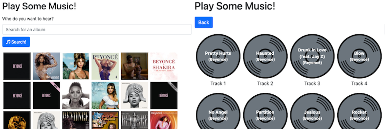

# Problem: Music Search (AJAX)

In this exercise you will practice using `fetch()` and Promises to download and display music previews from a web API (specifically, the [iTunes Search API](https://affiliate.itunes.apple.com/resources/documentation/itunes-store-web-service-search-api/)):



(The above image shows two pages; the first displays the results of searching the API for an album, and the second shows the tracks of an individual album).

## Running the Program
Because this app is created with React (and scaffolded through [Create React App](https://github.com/facebook/create-react-app)), you will need to install dependencies and run a developer web server in order to transpile and view the application. You can run this server by using the command:

```bash
# change directory to problem folder (this directory)
cd path/to/problem

# install dependencies
npm install  # only once

# run the server
npm start
```

You can then view the rendered page _in a web browser_. Remember to check the Developer console for any errors!

## Exercise Instructions
To complete the exercise, edit the included files in **`src/component/`** and add in the required code. Note that you should ___NOT___ edit any of the other provided files (including `index.html`).

The provided starter code will render components to display the search results&mdash;you will just need to add in the code to actually perform the AJAX search!

1. First, in the **`src/index.js`** file, `import` the `'whatwg-fetch'` library. This will make sure that the `fetch()` function is available no matter which browser the application is running on (it's a Node way of including a _polyfill_). Note that you aren't importing anything from the library, you're just importing the whole library itself.

2. In the **`src/components/AlbumSearchForm.js`** file, add code to initiate the music search when the form is submitted. Fill in the provided `handleSubmit()` function to do two things:

    1. Take the inputted `queryText` (stored in a state variable), and create an URL-encoded version (e.g., one with spaces and other illegal characters replaced by character codes). You can do this using the built-in [`encodeURIComponent()`](https://developer.mozilla.org/en-US/docs/Web/JavaScript/Reference/Global_Objects/encodeURIComponent) function. This will make sure you can properly search for bands or albums with multiple words in them.

    2. Call the `searchCallback()` function (which will be passed in as a prop), passing that function the encoded query text.

3. In the **`src/components/App.js`** file, define a function inside the `App` component called e.g., `fetchAlbumList()`. This function should expect a "search term" (a single string) as an argument. The function will use that search term to `fetch()` a list of music albums for the user to listen to.

    (You will pass this `fetchAlbumList` function to the rendered `<AlbumSearchForm>` Component as a `searchCallback` prop; you can test that the function is called correctly when the form is submitted by using `console.log()`)

    Inside the `fetchAlbumList()` function, you can get the URL to `fetch()` from by taking the provided `ALBUM_QUERY_TEMPLATE` and _replacing_ `"{searchTerm}"` (including the `{}`) with the function's argument. Try using the string's `.replace()` method!
    
    Send the AJAX request with `fetch()`, _then_ encode the response as JSON once it is received. Then assign the `results` property of the decoded data (which should be an array of objects) to the `albumData` state variable. This should cause the results to be displayed after searching. Note that including a `catch()` clause and logging out the error is a great tool when debugging.

    **Important note** The iTunes API that is used in this application can be... temperamental. Sometimes search queries return 0 results for some requests but not for others. If you don't get any results from a search for a well-known group, try a different group instead. It's not anything you're doing, it's just the API being uncooperative. 

4.  Once you application is able to perform basic searches and display the results, it's time to improve the user experience. Do this in two ways:

    1. Since asynchronous queries can take some time, it's best to provide **feedback to the user** about what is happening (so they don't think your app is broken). A good way to do this is to show a spinner when the data is loading.

        - Add a new state variable (e.g., `isSearching`) with an initial value of `false`. 
        - Also pass this state variable to the rendered `<AlbumSearchForm>` component as a prop called **`isWaiting`**.
        - In your `fetchAlbumList()` function, _before you send the AJAX request_, use the state-setter function to change that state value to `true`. This should cause a spinner to appear in place of the form's search button once you submit.
        - Additionally, after the fetch request returns data (so in *another new* `.then()` callback), use the state-setter function to change the state value back to `false`. This will cause the spinner to disappear once the search is completed.
    
    2. When accessing external resources, it's possible that something can go wrong beyond your control. Thus it's important to **handle and report errors to the user**.

        - Add a `.catch()` callback to the fetch call which will "catch" any errors that occur when downloading. Note that this will need to come _after_ the `.then()` which handles the encoded data, but _before_ the `.then()` which turns off the spinner. The `.catch()` callback function will be passed the `error` Object as its only argument. In the callback function, assign the `.message` property of the error object to the `alertMessage` state variable. This will cause the error alert to appear.

            Note that this is tricky to test, since the API won't usually give you an error! But you can _temporarily_ change the fetched URL to something invalid to make sure that the error message appears (remember to change it back afterwards).

        - Additionally, inside the `.then()` callback which receives the encoded data, add an _if_ statement to check if the `length` of the result array is 0. If so, set the `alertMessage` state variable to be the string `No results found.`. This will handle cases where no results are found (such as what happens if you submit an empty string as a search query).

            Alternatively, in this situation you could `throw` a `new Error()` object and then let your `catch()` function display the error... but just setting the displayed message directly tends to be a bit easier.

        - You'll need to remove any previous errors whenever the user issues a new search. You can do this by setting the `alertMessage` state variable to `null`. Do this _before_ the `fetch()` call (the same place where you initiate the spinner).

5. Clicking on of the displayed album images will navigate to a new route (`album/:collectionId`), which renders the `<TrackList>` Component. Modify this component in the **`src/components/TrackList.js`** file to download and display the individual songs on that album.

    The track data for the album needs to download when the Component is displayed, not in response to a user event like a click. But you need to wait for the Component to finish rendering before the data is downloaded. Thus you will need to `fetch()` the track data from inside of an **effect hook**. Import the `useEffect` function from the `react` library, and call it from inside the `TrackList()` component. The `useEffect()` function takes two arguments: the first is a _callback function_ (written as an arrow function without any arguments), and the second is an _array of dependencies_ (which values will cause the effect hook to "re-run" if they are changed). The dependency array will need to contain the `urlParams.collectionId` variable and the `setAlertMessage` variable (a prop).

    Inside the `useEffect()` callback, `fetch()` the track data for the url parameter's `collectionId` album, and assign the resulting track array to the `trackData` state variable. But there are some details to watch for:

    - You can get the URL to `fetch()` from by taking the provided `TRACK_QUERY_TEMPLATE` and _replacing_ the `{collectionId}` with the `collectionId` URL parameter (try using the string's `.replace()` method!).
    - The returned data object from that URL (when encoded into JSON) will contain the array of track data in the `results` property. _However_, the first item in the array isn't a track, but rather an object representing the album/collection. You will need to remove this item from the array. You can do this using the [`splice()`](https://developer.mozilla.org/en-US/docs/Web/JavaScript/Reference/Global_Objects/Array/splice) or [`slice()`](https://developer.mozilla.org/en-US/docs/Web/JavaScript/Reference/Global_Objects/Array/slice) array methods.

        If this works correctly, you should be able to click on an album and see a whole list of track disks (usually 10+). The _first_ disk should also be a track, which you can click on to play. If you don't see all those disks, or the first one doesn't list a track, then your code isn't correct. Try searching for an actual album you know the tracks of to confirm your work.

    - Similar to when downloading the album data, you should show a spinner as user feedback while the data is downloading. You can do this by setting the `isQuerying` state variable. Make the variable `true` before you start downloading, and set it to be `false` _after_ the data finishes downloading.
    - Similar to when downloading the album data, if there are no results in the data OR if any other errors occur, you should inform the user. You can do this by calling the `setAlertMessage()` function that was passed in as a prop. Use the message `No tracks found for album.` in the case there are no results.
    
        You can test your error message displaying by _temporarily_ fetching using an invalid URL. You can test the "no results" message displaying by using a valid fetch URL but an invalid collectionId URL parameter (e.g., 1234).

    When finished, visiting this route should display the list of tracks in the album. Click on a track to play a sample!
